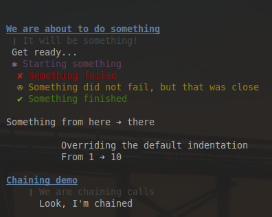

conzole
=======

Another console library using colors and symbols

## Installation

```
$ npm install --save conzole
```

## Available features

* title
* quote
* message (aliases: log, debug)
* start
* done
* warn
* failed
* fromTo
* ln
* clear
* indent


## Preview

Take a look at `playground.js` for the code producing this screenshot:


